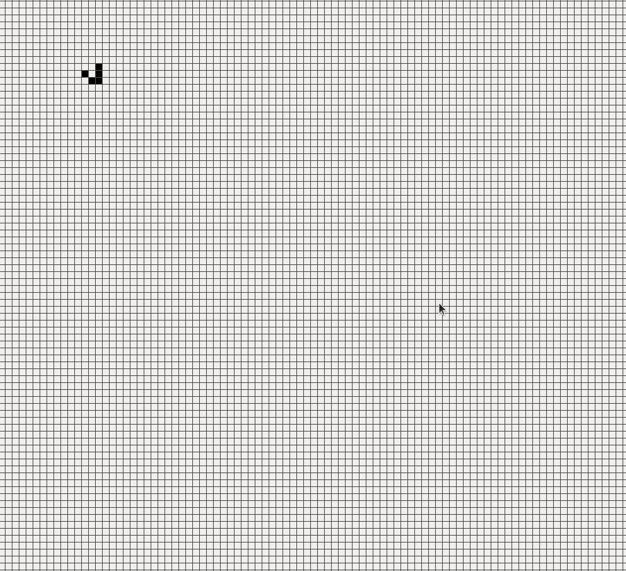

# Hashlife

Hashlife paper https://www.sciencedirect.com/science/article/pii/0167278984902513/pdf?md5=1291b5a1baedd285d9abdef6701f3b0b&pid=1-s2.0-0167278984902513-main.pdf

Running a code in linux requires sfml library installable via
```sudo apt install libsfml-dev```
and cmake library installable via 
```sudo apt install cmake```
cd to the download folder and run 
```cmake .```
to build the Makefile and 
```cmake --build .```
to build the Hashlife binary

This is a GOL implementation based on hashlife and on regular hashed quadtrees.
After launching the binary, the game plan with squares is displayed.
Each square represents single cell, which could be in 2 states: dead (white) or alive(black).
Clicking on the cell in the game plan toggles its state.
Next state of the cell is calculated from the previous cell by using GOL rules.

Simulation is started/paused pressing the S key,
hashlife mode is turned on/off by pressing H key



The algorhitm uses quadtree nodes. It is a node, which has either 4 children or it is a leaf.
The base of the calculation is recursive algorhitm for updating the node.
Considering 4 nodes of level k, we want to calculate the update node lying on the center of this node.
We are doing it by creating 9 (k-1)-level center nodes and recursively calculating nodes from their combination.
We have established custom, relatively primitive hash to allow hashing the nodes and storing them in `unordered_map`
Because most nodes repeat during the run of our algorhitm, we have decreased the number of nodes we are calculating.
The hashlife algorhitm enhances this approach by recursively computing the 9 subsquares with update function, making it compute
multiple generations at once. 


This center square should be computed from half level shifted 4 nodes to top left, so it overlays with the previuos square.


